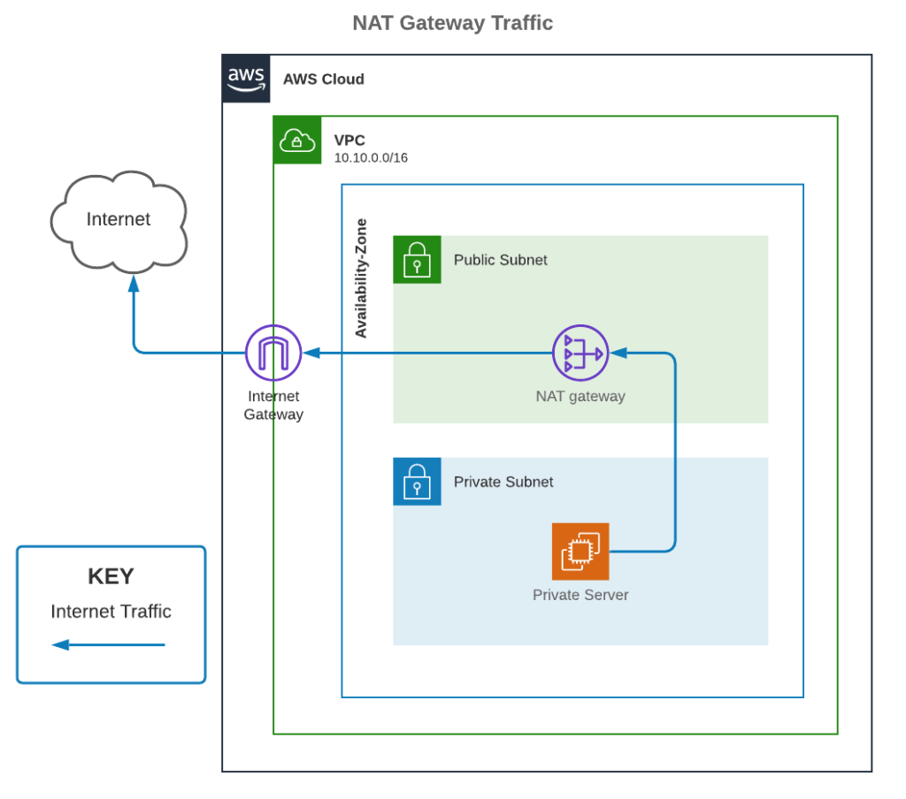

# AWS Multi-Region Deployment

These notes are in chronological order, each section represents a milestone. 

## 1. The Basics
A) Structure: moving terraform configuration to terraform.tf file to define state and version constraints. Also, this code should run on a newer version with no issue, so checking that this is the case then locking in that constraint, to save time by using what I've already got installed. 

I've used remote state for safety. When running this on another AWS account, you must either comment out the `terraform` block or manually create a bucket which matches the configuration. In a real prod env, I would also implement dynamodb state locking, or use a tool such as [atlantis](https://www.runatlantis.io/) to prevent simltaneous writes to state. I've opted not to here, so that this code can be ran easily against another AWS account with the need to create too many resources manually. 

B) Authentication: I'm using a personal sandbox account, so used my existing long-lived credentials. In a prod environment, I would set up role-based access for devs to run `terraform plan` with readonly locally, and apply using a CI/CD pipeline or plugin. 

C) Checked that the original code does work, but only in HTTP, which is expected. In a prod env there'd be ssl certs and HTTPS traffic enforcement, but in this case I have updated the output, for ease and clarity. I will also remove the https port access as it's not actually used. 

## 2. Replicating the stack to another region 
I believe the best way to achieve this is to use modularisation for the VPC, and to have seperate directories for each region. The AWS VPC module is quite good, and is often used in production. If there was a usecase where there is a specific configuration that isn't easily achieved by the module, then it would make more sense to build the VPC from scratch like this. 

I also want to get rid of the `tfvar` files here. It's ugly when deploying in a wrapper (as the apply command has to be parametised). As most of these variables would not be changed by a user on most applies, it's better to use `local` blocks here, in my opinion. 

I removed the port 22 access, and note that an improvement would be to implement VPC endpoints and improve security, specifically to allow admin users with access to assume an ssm role to login to the instances for debugging, without the need to open ssh ports. The instances also don't need public IPs (will be removed in the next step), or HTTPS (discussed earlier).

Regarding the location of terraform modules, it's good practice to have them in a seperate repository, so that they can be versioned seperately in different environments / regions, but there's also an argument to be made for reducing number of PRs and number of steps required to deploy a change. The fast feedback loop is desirable for my local development, so they're here.

At this stage I did run into issues with the AMI, the naming convention of linux AMIs is not consistent across AWS regions, so it's hard to source it dynamically, even the TF documentation does not have an example for this, only for ubuntu. I switched to an ubuntu image to save time and changed the user-data commands accordingly, but note that I would not make this decision so lightly in a live environment. 

## 3. High Availability 

Options: 
A) ASG with Load Balancer, does the job, fastest
B) EKS / Managed Kubernetes cluster -> definetely overkill, and more time consuming
C) ECS with multiple containers - better than just running code directly on the instance, but will need at least two instances where containers are running to make sure there is still availability if the instance goes down. So this would actually also require an autoscaling group to keep two instances up, which makes me think why not just do option A. 
D) Lambda, actually there's a nice tutorial [here](https://it20.info/2021/11/running-the-stock-nginx-container-image-with-aws-lambda/).

For a live env it would also be good to load balance across multiple AZs, to protect against third party outage affecting one or more zones.

Both lambda and ECS require containerisation (can just use light nginx image) and ECR respositories, task execution roles etc, so I've gone for option A as it's the fastest, and created a cross-AZ load balancer and autoscaling group, which can be accessed via the load balancer's dns_name. 

(I can't spend more time on this task, but please find the following ideas for how I would approach the rest of the requirements.)

## 4. Private Subnets 
I would define three private subnets and move the instances there, and would create a  NAT gateway to allow egress connectivity from the private subnet through the NAT gateway in the public subnets, and out through the IGW. It's overkill in this case, and there's definetely a cost consideration, but it's also possible to create one NAT gateway per private subnet, to avoid a single point of failure. (Image source: https://www.uturndata.com/2021/02/23/aws-quick-tips-internet-gateways-nat-gateways-and-nat-instances/)

I would use the VPC module, as it will create the route tables, route table associations etc behind the scenes. 

## 5. Local Development / Docker Wrapper Script 
1. Where will terraform run?
    TBH This is not the solution I would choose for developers to be able to run plans because it creates unnecessary overhead. With terraform, the version constraints of all the modules should be defined using the provider blocks and in the code. So there is not really a need for an isolated environment because it's just the one dependency - the terraform version. 

    If there is a desire to hold multiple versions of terraform on their machine and switch between them, then I would recommend [this command line tool ](https://github.com/warrensbox/terraform-switcher). 

    If I needed to use a Dockerfile, I would make sure a) it's built on a light image, e.g alpine, and that there are as few lines as possible to reduce the size of the image and b) implement a fail-safe to make sure the correct AWS role, for example, is being pulled in. As an example, I previously used a similar tool where I was required to use `export AWS_PROFILE=<profile>` at the beginning of every terraform command, it was cumbersome but effective. 

    For applies, I would use a tool such as atlantis running on a simple container service to run plans as part of PRs, and apply only when the PR has been approved, or a CI/CD pipeline, requiring approval as well. 

2. How will devs authenticate to AWS? 
    I would create two different AWS roles, one which devs can assume using their personal credentials and would grant read access to run terraform plans, and one which can only be assumed by the pipeline. For this OIDC can be used to avoid saving long-lived credentials onto the instance. 

